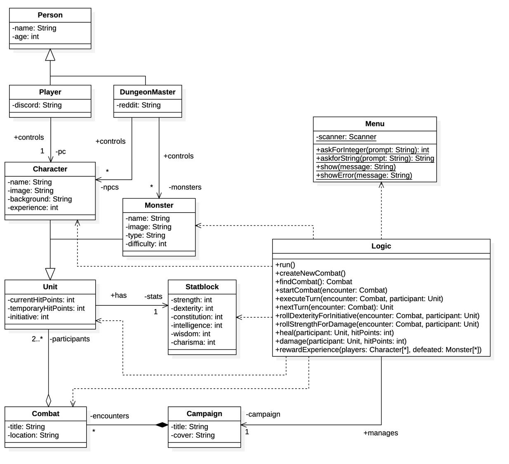
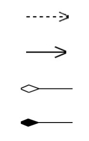

# Problema 1: Test conceptual (resposta múltiple)

Marca les opcions correctes per cada pregunta (n’hi pot haver de 0 a 4, inclosos). Cal entregar l’enunciat amb les respostes, i els errors resten. **[3 punts]**

1. Farem servir una classe abstracta...

- a. Si no ens surt la implementació d’un dels seus mètodes.
- b. Si no volem permetre’n la instanciació de cap forma.
- c. Sempre que hereti mètodes abstractes.

- d. Quan vulguem tenir subclasses que implementin un mateix mètode genèric.

2. Una interfície...

- a. Defineix mètodes sense implementar-los.
- b. És el que veu l’usuari per pantalla.
- c. Sempre tindrà atributs.
- d. Permet que dos classes es comuniquin sense conèixer-se.

3. Els patrons GRASP...

- a. Són obligatoris.
- b. Defineixen com fer que un programa escrit en Java compili.
- c. Són dos: High Cohesion i Low Coupling.
- d. Els va inventar Edsger W. Grasp.

# Problema 1: Test conceptual (resposta múltiple)

Marca les opcions correctes per cada pregunta (n’hi pot haver de 0 a 4, inclosos). Cal entregar l’enunciat amb les respostes, i els errors resten. **[3 punts]**

1. Els quatre principis de la programació orientada a objectes inclouen...

- a. Encapsulament.
- b. Abstracció.
- c. Herència.
- d. Polimorfisme.

2. Un diagrama UML...

- a. No pot representar conceptes avançats com les interfícies.
- b. Hauria de plantejar-se abans que el codi que representa.
- c. Mai inclou atributs i mètodes privats.
- d. És una forma estàndard de comunicar-nos com a programadors.

3. La Layered Architecture...

- a. Defineix capes que abstrauen parts del nostre codi.
- b. És obligatòria.
- c. Sovint es tradueix en una estructura de paquets.
- d. Serveix per aconseguir que un programa escrit en Java compili.

# Problema 1: Conceptes

Defineix amb les teves paraules i compara les següents parelles de conceptes: **[4 punts]**

- Programació imperativa - Programació orientada a objectes
- Dependència - Associació
- Interfície - Classe abstracta
- GRASP - Layered Architecture

# Problema 1: Conceptes

Explica què és el polimorfisme i les diferents formes que tenim d’obtenir-lo. Com es relaciona amb els altres fonaments de la Programació Orientada a Objectes? Posa un exemple pràctic on el polimorfisme faciliti la solució d’un problema (pots fer servir codi i/o diagrames si ho creus necessari). **[3 punts]**

# Problema 1: Test conceptual (respuesta múltiple)

Marca las opciones correctas para cada pregunta (puede haber de 0 a 4, incluidos). Se debe entregar en enunciado con las respuestas, y los errores restan. **[3 puntos]**

1. El polimorfismo...

- a. Es la capacidad de una clase para heredar de múltiples clases.
- b. Es la capacidad de una clase para contener instancias de otras clases.
- c. Es la capacidad de una clase para ocultar su implementación interna.
- d. Es la capacidad de un objeto de una clase base para ser tratado como un objeto de cualquiera de sus clases derivadas.

2. La encapsulación en programación orientada a objetos...

- a. Facilita la creación de objetos.
- b. Oculta la implementación interna de una clase.
- c. Permite heredar propiedades de una clase base.
- d. Proporciona acceso controlado a los atributos y métodos de una clase.

3. El patrón Experto en Información...

- a. Delega todas las responsabilidades a una única clase para simplificar la estructura del programa.
- b. Asigna la responsabilidad de una tarea a la clase que posee la información necesaria para llevar a cabo esa tarea.
- c. Garantiza que todas las clases tengan acceso a la misma información sin restricciones.
- d. Limita la información disponible a las clases para promover la seguridad.

# Problema 2: Preguntes teòriques

- Explica amb les **teves paraules** el que signifiquen els quatre principis de la programació orientada a objectes (encapsulament, abstracció, herència, polimorfisme). **[2 punts]**

- Explica amb les **teves paraules** què és la _Layered Architecture_, sense entrar en detalls. Quines són les avantatges que ens proporciona com a programadors? **[1 punt]**

- Explica amb les **teves paraules** per què creus que és important modelar diagrames de classe en UML. **[1 punt]**

# Problema 2: Preguntes teòriques

- Explica amb les teves paraules què és una classe abstracta i com es diferencia d’una interfície. En quines situacions ens decantarem per cadascuna? **[2 punts]**

- Explica amb les teves paraules què són els patrons GRASP, sense entrar en detalls. Quins són els avantatges que ens proporcionen com a programadors? **[1 punt]**

- Explica amb les teves paraules per què creus que és important la programació orientada a objectes. **[1 punt]**

# Problema 2: Disseny

Volem començar a desenvolupar una plataforma. Encara no sabem ben bé si serà una xarxa social, un videojoc online o un portal de notícies, però el que sí que sabem és que tindrem usuaris. Feu servir els patrons vistos a classe per dissenyar un diagrama de classes UML que suporti les següents funcionalitats: **[3 punts]**

- Registrar un nou usuari: Cal demanar per pantalla nom, direcció de correu electrònic, contrasenya i any de naixement, per després persistir aquesta informació.

- Entrar a la plataforma amb un usuari existent. Cal demanar per pantalla direcció de correu electrònic i contrasenya, per comprovar si l’usuari existeix i les credencials són correctes.

Tingueu en compte que no estem segurs de com es persistirà aquesta informació, però de moment volem fer la prova amb fitxers JSON.

# Problema 2: Disseny

L’UraMaki Lounge, un dels nostres restaurants preferits, està modernitzant-se i ens ha demanat ajuda desenvolupant un software que els permeti gestionar les receptes amb les que treballen.

Sabem que una recepta està formada per un nom, un text amb instruccions i un seguit d’ingredients en diferents quantitats (expressades en grams). El restaurant té un conjunt limitat d’ingredients amb els que treballa, i de cadascun en sabem el nom i el preu per quilo en euros.

Fes servir els patrons vistos a classe per dissenyar un diagrama de classes UML que suporti les següents funcionalitats:

- Afegir nova recepta: Caldrà demanar per pantalla tot el que sigui necessari. Cal persistir la recepta després de comprovar que el nom sigui únic i que els ingredients existeixin.

- Llistar receptes: Es mostrarà per pantalla un llistat numerat amb el nom de cada recepta. Es podrà escollir veure la informació completa d’una recepta en concret.

Tingues en compte que ara mateix persistirem la informació en un fitxer local en format JSON, però sabem que en algun moment ho canviarem per un servidor remot. Això inclou la informació de les receptes, però també el llistat d’ingredients disponibles.

És recomanable justificar per escrit les decisions de disseny que considereu més importants.

# Problema 3: Disseny

- Donat el següent diagrama UML, i tenint en compte que no s’hi ha representat cap constructor, _getter_ ni _setter_:



- Identifica els diferents tipus de relacions (sense comptar l’herència) que hi apareixen. Indica’n el nom i la representació UML. Quina diferència hi ha entre elles? **[1 punt]**

- Seria recomanable implementar un sistema amb aquesta estructura de codi? Justifica la teva resposta. En cas negatiu, explica quins canvis hi faries i per què. **[2 punts]**

# Problema 3: Disseny

- Identifica les següents relacions a partir de la seva representació UML. Quina diferència hi ha entre elles? Descriu-les una a una abans de comparar-les en termes generals. **[1 punt]**



- Dissenya un petit diagrama de classes que faci servir les relacions de l’apartat anterior, juntament amb l’herència (o altres mecanismes per obtenir polimorfisme). Inclou alguns atributs i mètodes, tot justificant les decisions que has pres. **[2 punts]**

# Problema 3: Codi

Assumint que la sintaxi i la lògica són correctes, identifica tres errors conceptuals o aspectes millorables en el següent codi. Intenta no repetir el mateix diversos cops i justifica les teves respostes.

```java
1  public class Controller {
2	    private MarketManager manager;
3
4	    public Controller(MarketManager manager) {
5	        this.manager = manager;
6	    }
7
8	    // Assume the following two public functions are called somewhere
9	    public void createProduct() {
10	        String name = Menu.askForString("Enter the product's name: ");
11	        String type = Menu.askForString("Enter the product's type: ");
12	        double price = Menu.askForDouble("Enter the product's price: ");
13
14	        if (getProductByName(name) == null) {
15	            addProduct(name, type, price);
16	            Menu.showMessage("Successfully created the new product");
17	        } else {
18	            Menu.showError("Product " + name + " already exists");
19	        }
20	    }
21
22	    public void showProductPrice() {
23	        String name = Menu.askForString("Enter the product's name: ");
24	        Product product = getProductByName(name);
25
26	        switch (product.getType()) {
27	            case "discounted":
28	                Menu.showMessage("Total price: " + product.getPrice() / 2);
29	                break;
30	            default:
31	                Menu.showMessage("Total price: " + product.getPrice());
32	                break;
33	        }
34	    }
35
36	    private Product getProductByName(String name) {
37	        for (int i = 0; i < this.manager.getProducts().size(); i++) {
38	            if (this.manager.getProducts().get(i).getName().equals(name)) {
39	                return this.manager.getProducts().get(i);
40	            }
41	        }
42	        return null;
43	    }
44
45	    private void addProduct(String name, String type, double price) {
46	        this.manager.getProducts().add(new Product(name, type, price));
47	    }
48	}
```

# Problema 3: Codi

Durant el procés de desenvolupament d’un projecte que fa servir arquitectura per capes hem arribat a dues versions diferents d’una mateixa funcionalitat a dins un Controller.

A continuació trobaràs els dos fragments de codi corresponents. Compara’ls tenint en compte els patrons de disseny vistos a classe, així com els fonaments de la Programació Orientada a Objectes. Quin escolliries com a versió final? Per què? Pots assumir que ambdós compilen i que la lògica és correcta i equivalent entre ells. **[3 punts]**

##### Fragment A:

```java
1	public void doRegister() {
2	    System.out.println("Enter your email: ");
3	    String email = this.view.scanner.nextLine();
4
5	    System.out.println("Enter your password: ");
6	    String password = this.view.scanner.nextLine();
7
8	    int age;
9	    while (true) {
10	        System.out.println("Enter your age: ");
11	        try {
12	            age = this.view.scanner.nextInt();
13	            break;
14	        } catch (InputMismatchException e) {
15	            System.err.println("You must enter a number");
16	        } finally {
17	            this.view.scanner.nextLine();
18	        }
19	    }
20
21	    User existing = this.dao.readUserByEmail(email);
22
23	    if (existing != null) {
24	        System.err.println("That email is taken");
25	    } else if (!this.manager.checkEmail(email)){
26	        System.err.println("You must enter a correct email");
27	    } else {
28	        this.dao.createUser(new User(email, password, age));
29	    }
30	}

```

##### Fragment B:

```java
1	public void doRegister() {
2	    String email = this.view.askForString("Enter your email: ");
3	    String password = this.view.askForString("Enter your password: ");
4	    int age = view.askForInteger("Enter your age: ");
5
6	    try {
7	        manager.registerUser(email, password, age);
8	    } catch (BusinessException e) {
9	        view.showError(e.getMessage());
10	    }
11	}
```
