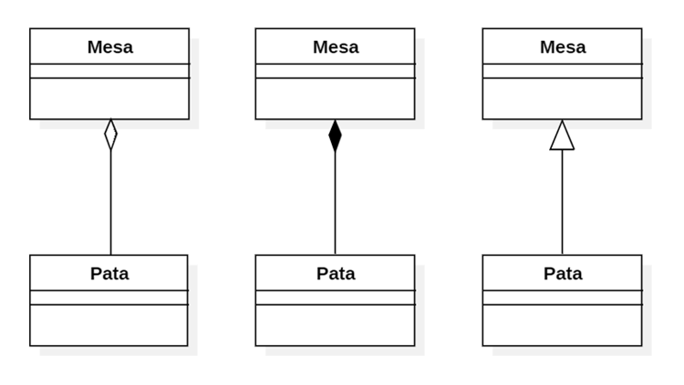

# Problema 1: Test conceptual (resposta múltiple)

Marca les opcions correctes per cada pregunta (n’hi pot haver de 0 a 4, inclosos). Cal entregar l’enunciat amb les respostes, i els errors resten. **[3 punts]**

1. Farem servir una classe abstracta...

- a. Si no ens surt la implementació d’un dels seus mètodes.
- b. Si no volem permetre’n la instanciació de cap forma.
- c. Sempre que hereti mètodes abstractes.

- d. Quan vulguem tenir subclasses que implementin un mateix mètode genèric.

2. Una interfície...

- a. Defineix mètodes sense implementar-los.
- b. És el que veu l’usuari per pantalla.
- c. Sempre tindrà atributs.
- d. Permet que dos classes es comuniquin sense conèixer-se.

3. Els patrons GRASP...

- a. Són obligatoris.
- b. Defineixen com fer que un programa escrit en Java compili.
- c. Són dos: High Cohesion i Low Coupling.
- d. Els va inventar Edsger W. Grasp.

# Problema 1: Test conceptual (resposta múltiple)

Marca les opcions correctes per cada pregunta (n’hi pot haver de 0 a 4, inclosos). Cal entregar l’enunciat amb les respostes, i els errors resten. **[3 punts]**

1. Els quatre principis de la programació orientada a objectes inclouen...

- a. Encapsulament.
- b. Abstracció.
- c. Herència.
- d. Polimorfisme.

2. Un diagrama UML...

- a. No pot representar conceptes avançats com les interfícies.
- b. Hauria de plantejar-se abans que el codi que representa.
- c. Mai inclou atributs i mètodes privats.
- d. És una forma estàndard de comunicar-nos com a programadors.

3. La Layered Architecture...

- a. Defineix capes que abstrauen parts del nostre codi.
- b. És obligatòria.
- c. Sovint es tradueix en una estructura de paquets.
- d. Serveix per aconseguir que un programa escrit en Java compili.

# Problema 1: Conceptes

Defineix amb les teves paraules i compara les següents parelles de conceptes: **[4 punts]**

- Programació imperativa - Programació orientada a objectes
- Dependència - Associació
- Interfície - Classe abstracta
- GRASP - Layered Architecture

# Problema 1: Conceptes

Explica què és el polimorfisme i les diferents formes que tenim d’obtenir-lo. Com es relaciona amb els altres fonaments de la Programació Orientada a Objectes? Posa un exemple pràctic on el polimorfisme faciliti la solució d’un problema (pots fer servir codi i/o diagrames si ho creus necessari). **[3 punts]**

# Problema 1: Test conceptual (respuesta múltiple)

Marca las opciones correctas para cada pregunta (puede haber de 0 a 4, incluidos). Se debe entregar en enunciado con las respuestas, y los errores restan. **[3 puntos]**

1. El polimorfismo...

- a. Es la capacidad de una clase para heredar de múltiples clases.
- b. Es la capacidad de una clase para contener instancias de otras clases.
- c. Es la capacidad de una clase para ocultar su implementación interna.
- d. Es la capacidad de un objeto de una clase base para ser tratado como un objeto de cualquiera de sus clases derivadas.

2. La encapsulación en programación orientada a objetos...

- a. Facilita la creación de objetos.
- b. Oculta la implementación interna de una clase.
- c. Permite heredar propiedades de una clase base.
- d. Proporciona acceso controlado a los atributos y métodos de una clase.

3. El patrón Experto en Información...

- a. Delega todas las responsabilidades a una única clase para simplificar la estructura del programa.
- b. Asigna la responsabilidad de una tarea a la clase que posee la información necesaria para llevar a cabo esa tarea.
- c. Garantiza que todas las clases tengan acceso a la misma información sin restricciones.
- d. Limita la información disponible a las clases para promover la seguridad.

# Problema 1: Conceptos

Define con tus propias palabras y compara las siguientes parejas de conceptos: **[3 puntos]**

- Programación imperativa - Programación orientada a objetos
- Polimorfismo vertical – Polimorfismo horizontal
- Clase - Objeto
- Alta cohesión – Bajo acoplamiento

# Problema 2: Preguntes teòriques

- Explica amb les **teves paraules** el que signifiquen els quatre principis de la programació orientada a objectes (encapsulament, abstracció, herència, polimorfisme). **[2 punts]**

- Explica amb les **teves paraules** què és la _Layered Architecture_, sense entrar en detalls. Quines són les avantatges que ens proporciona com a programadors? **[1 punt]**

- Explica amb les **teves paraules** per què creus que és important modelar diagrames de classe en UML. **[1 punt]**

# Problema 2: Preguntes teòriques

- Explica amb les teves paraules què és una classe abstracta i com es diferencia d’una interfície. En quines situacions ens decantarem per cadascuna? **[2 punts]**

- Explica amb les teves paraules què són els patrons GRASP, sense entrar en detalls. Quins són els avantatges que ens proporcionen com a programadors? **[1 punt]**

- Explica amb les teves paraules per què creus que és important la programació orientada a objectes. **[1 punt]**

# Problema 2: Disseny

Volem començar a desenvolupar una plataforma. Encara no sabem ben bé si serà una xarxa social, un videojoc online o un portal de notícies, però el que sí que sabem és que tindrem usuaris. Feu servir els patrons vistos a classe per dissenyar un diagrama de classes UML que suporti les següents funcionalitats: **[3 punts]**

- Registrar un nou usuari: Cal demanar per pantalla nom, direcció de correu electrònic, contrasenya i any de naixement, per després persistir aquesta informació.

- Entrar a la plataforma amb un usuari existent. Cal demanar per pantalla direcció de correu electrònic i contrasenya, per comprovar si l’usuari existeix i les credencials són correctes.

Tingueu en compte que no estem segurs de com es persistirà aquesta informació, però de moment volem fer la prova amb fitxers JSON.

# Problema 2: Disseny

L’UraMaki Lounge, un dels nostres restaurants preferits, està modernitzant-se i ens ha demanat ajuda desenvolupant un software que els permeti gestionar les receptes amb les que treballen.

Sabem que una recepta està formada per un nom, un text amb instruccions i un seguit d’ingredients en diferents quantitats (expressades en grams). El restaurant té un conjunt limitat d’ingredients amb els que treballa, i de cadascun en sabem el nom i el preu per quilo en euros.

Fes servir els patrons vistos a classe per dissenyar un diagrama de classes UML que suporti les següents funcionalitats:

- Afegir nova recepta: Caldrà demanar per pantalla tot el que sigui necessari. Cal persistir la recepta després de comprovar que el nom sigui únic i que els ingredients existeixin.

- Llistar receptes: Es mostrarà per pantalla un llistat numerat amb el nom de cada recepta. Es podrà escollir veure la informació completa d’una recepta en concret.

Tingues en compte que ara mateix persistirem la informació en un fitxer local en format JSON, però sabem que en algun moment ho canviarem per un servidor remot. Això inclou la informació de les receptes, però també el llistat d’ingredients disponibles.

És recomanable justificar per escrit les decisions de disseny que considereu més importants.

# Problema 2: Diseño

Nos piden diseñar una parte del modelo de negocio de un videojuego de combates espaciales:

Los jugadores que siempre estarán identificados por un identificador y nombre serán los protagonistas en tercera persona del juego. Al crear un personaje, el juego nos permitirá seleccionar entre 4 razas: Humano, Goa’uld, Vulcano o Mandaloriano. La raza es importante en el combate espacial ya que cada uno realizará una maniobra especial única en su especie.

Asimismo, el jugador tendrá un hangar en el que podremos guardar nuestras naves de combate (7 en total), cada nave tendrá características únicas como durabilidad, blindaje, velocidad máxima soportada, un espacio donde poder colocar una o dos armas y el motor.

Cada arma tendrá una durabilidad, velocidad de ataque, alcance y daño.

El motor nos permitirá acelerar y frenar con más o menos dificultad. El motor se podrá ir mejorando para que nos dé más prestaciones (mejor aceleración y frenado).

Las naves de combate y armas se pueden comprar, vender, mejorar y reparar en el mercado.

Es recomendable justificar por escrito las decisiones de diseño que consideréis más importantes.

# Problema 2: Diseño

Nos piden diseñar una parte del modelo de negocio de una tienda online:

Los usuarios de la aplicación harán login en nuestra tienda online. Después de hacer login en sistema detectará si el usuario es un cliente o un administrador.

El administrador se encargará solamente de revisar el stock: Podrá añadir, editar y eliminar los productos existentes.

Los clientes son un usuario del que necesitaremos guardar la información referente a este: nombre, dirección, teléfono, email. El cliente podrá consultar productos y añadirlos a una orden de compra. Una orden de compra tendrá un numero a modo de identificador, la fecha en la que se ha creado, la fecha en la que se haya enviado, la dirección de envío, el estado de la orden (nueva, enviada, entregada, cerrada), el total, el descuento aplicado (si lo hay), y el precio final. Además, debería incluir información sobre el pago y tantas líneas como productos integrados en la orden de compra. Asimismo, una línea de la orden de compra debe indicarlos la información del producto, la cantidad y el precio.

La información sobre el pago indicará cuando se llevó a cabo el pago, el total pagado y el tipo de pago. El sistema, por el momento, puede admitir 3 tipos de pago: Efectivo, Tarjeta y Bitcoin. Más adelante, se querrá incluir otro tipo de pago: Apple pay o Paypal. Dependiendo del tipo de pago querremos guardar la siguiente información:

- Efectivo: Cuanto se ha pagado y cuanto se ha devuelto.
- Tarjeta: El número de la tarjeta de crédito con la que se ha realizado el pago.
- Bitcoin: La dirección de la wallet.

Diseña el diagrama de clases con sus atributos y relaciones según el texto anterior. Es recomendable justificar por escrito las decisiones de diseño que consideréis más importantes.

# Problema 3: Disseny

- Donat el següent diagrama UML, i tenint en compte que no s’hi ha representat cap constructor, _getter_ ni _setter_:


- Identifica els diferents tipus de relacions (sense comptar l’herència) que hi apareixen. Indica’n el nom i la representació UML. Quina diferència hi ha entre elles? **[1 punt]**

- Seria recomanable implementar un sistema amb aquesta estructura de codi? Justifica la teva resposta. En cas negatiu, explica quins canvis hi faries i per què. **[2 punts]**

# Problema 3: Disseny

- Identifica les següents relacions a partir de la seva representació UML. Quina diferència hi ha entre elles? Descriu-les una a una abans de comparar-les en termes generals. **[1 punt]**


- Dissenya un petit diagrama de classes que faci servir les relacions de l’apartat anterior, juntament amb l’herència (o altres mecanismes per obtenir polimorfisme). Inclou alguns atributs i mètodes, tot justificant les decisions que has pres. **[2 punts]**

# Problema 3: Codi

Assumint que la sintaxi i la lògica són correctes, identifica tres errors conceptuals o aspectes millorables en el següent codi. Intenta no repetir el mateix diversos cops i justifica les teves respostes.

```java
1  public class Controller {
2	    private MarketManager manager;
3
4	    public Controller(MarketManager manager) {
5	        this.manager = manager;
6	    }
7
8	    // Assume the following two public functions are called somewhere
9	    public void createProduct() {
10	        String name = Menu.askForString("Enter the product's name: ");
11	        String type = Menu.askForString("Enter the product's type: ");
12	        double price = Menu.askForDouble("Enter the product's price: ");
13
14	        if (getProductByName(name) == null) {
15	            addProduct(name, type, price);
16	            Menu.showMessage("Successfully created the new product");
17	        } else {
18	            Menu.showError("Product " + name + " already exists");
19	        }
20	    }
21
22	    public void showProductPrice() {
23	        String name = Menu.askForString("Enter the product's name: ");
24	        Product product = getProductByName(name);
25
26	        switch (product.getType()) {
27	            case "discounted":
28	                Menu.showMessage("Total price: " + product.getPrice() / 2);
29	                break;
30	            default:
31	                Menu.showMessage("Total price: " + product.getPrice());
32	                break;
33	        }
34	    }
35
36	    private Product getProductByName(String name) {
37	        for (int i = 0; i < this.manager.getProducts().size(); i++) {
38	            if (this.manager.getProducts().get(i).getName().equals(name)) {
39	                return this.manager.getProducts().get(i);
40	            }
41	        }
42	        return null;
43	    }
44
45	    private void addProduct(String name, String type, double price) {
46	        this.manager.getProducts().add(new Product(name, type, price));
47	    }
48	}
```

# Problema 3: Codi

Durant el procés de desenvolupament d’un projecte que fa servir arquitectura per capes hem arribat a dues versions diferents d’una mateixa funcionalitat a dins un Controller.

A continuació trobaràs els dos fragments de codi corresponents. Compara’ls tenint en compte els patrons de disseny vistos a classe, així com els fonaments de la Programació Orientada a Objectes. Quin escolliries com a versió final? Per què? Pots assumir que ambdós compilen i que la lògica és correcta i equivalent entre ells. **[3 punts]**

##### Fragment A:

```java
1	public void doRegister() {
2	    System.out.println("Enter your email: ");
3	    String email = this.view.scanner.nextLine();
4
5	    System.out.println("Enter your password: ");
6	    String password = this.view.scanner.nextLine();
7
8	    int age;
9	    while (true) {
10	        System.out.println("Enter your age: ");
11	        try {
12	            age = this.view.scanner.nextInt();
13	            break;
14	        } catch (InputMismatchException e) {
15	            System.err.println("You must enter a number");
16	        } finally {
17	            this.view.scanner.nextLine();
18	        }
19	    }
20
21	    User existing = this.dao.readUserByEmail(email);
22
23	    if (existing != null) {
24	        System.err.println("That email is taken");
25	    } else if (!this.manager.checkEmail(email)){
26	        System.err.println("You must enter a correct email");
27	    } else {
28	        this.dao.createUser(new User(email, password, age));
29	    }
30	}

```

##### Fragment B:

```java
1	public void doRegister() {
2	    String email = this.view.askForString("Enter your email: ");
3	    String password = this.view.askForString("Enter your password: ");
4	    int age = view.askForInteger("Enter your age: ");
5
6	    try {
7	        manager.registerUser(email, password, age);
8	    } catch (BusinessException e) {
9	        view.showError(e.getMessage());
10	    }
11	}
```

# Problema 3: Preguntas teóricas

• De los siguientes diagramas UML, ¿cuál representaría más el modelado de una mesa y sus patas? Explica brevemente tu decisión, indica los nombres de las relaciones, qué características tienen y pon un ejemplo de cada una de ellas. **[2 puntos]**



• Explica con tus palabras por qué cree que es importante modelar diagramas de clase en UML. **[1 punto]**

# Problema 3: Código

Queremos añadir un miembro nuevo en el equipo de desarrollo y estamos haciendo entrevistas a posibles candidatos. Hemos recibido el código del primer candidato y nos ha mandado lo siguiente:

```java
public class Usuario {
    String id;
    String name;
}

public class Menu {
    // asumimos que esta clase es correcta y no tiene ningún error
}

public class UsuarioManager {
    public HashMap<String, Usuario> usuarios;

    public void save(Usuario usuario) {
        usuarios.put(usuario.id, usuario);
    }
}

public class Controller {
    private Menu menu;
    private UsuarioManager manager;

    public Controller(UsuarioManager manager) {
        this.menu = new Menu();
        this.manager = manager;
    }

    public void pideYGuardaDosUsuarios() {
        Usuario usuario = new Usuario();

        usuario.id = 1;
        usuario.name = Menu.askForString("Enter your name");
        if (usuario.name == null) {
            Menu.showMessage("Name is required");
            return;
        }
        saveUser(usuario);

        usuario.id = 2;
        usuario.name = Menu.askForString("Enter your name");
        if (usuario.name == null) {
            Menu.showMessage("Name is required");
            return;
        }
        saveUser(usuario);

        Menu.showMessage("You've introduced: " + manager.usuarios.toString());
    }

    public void saveUser(Usuario usuario) {
        manager.save(usuario);
    }
}
```

A continuación, un ejemplo de cómo se utilizarían las clases anteriores:

```java
UsuarioManager manager = new UsuarioManager();
Controller controller = new Controller(manager);
controller.pideYGuardaDosUsuarios();
```

¿Serías capaz de detectar qué errores (a nivel conceptual) y qué aspectos mejorables tiene este código? Justifica tus respuestas.
